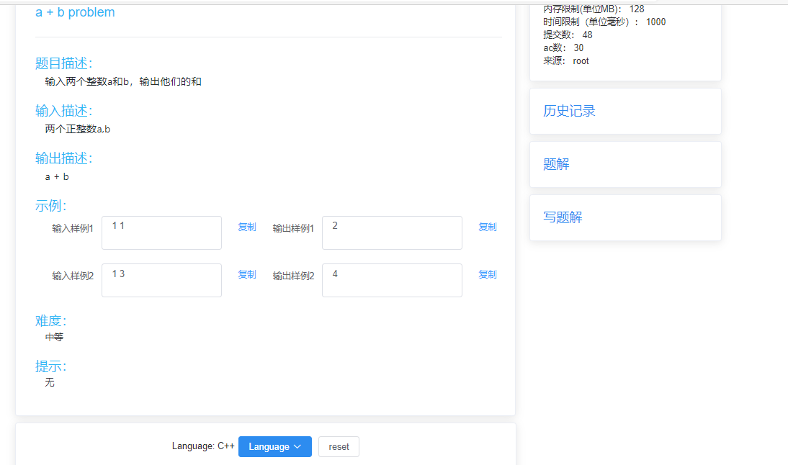
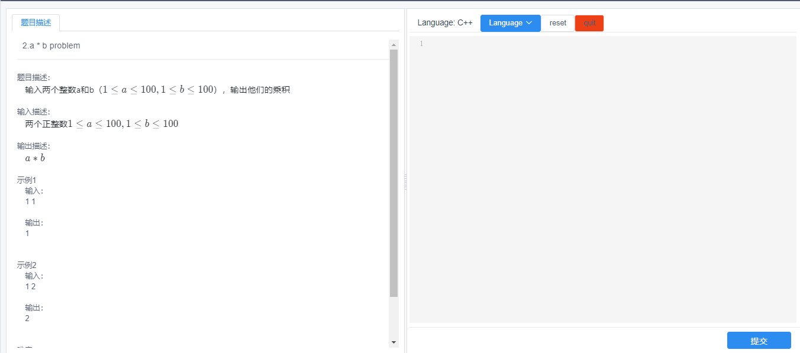
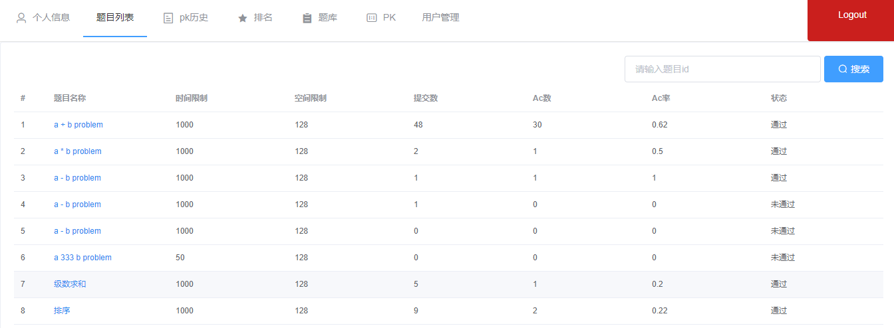
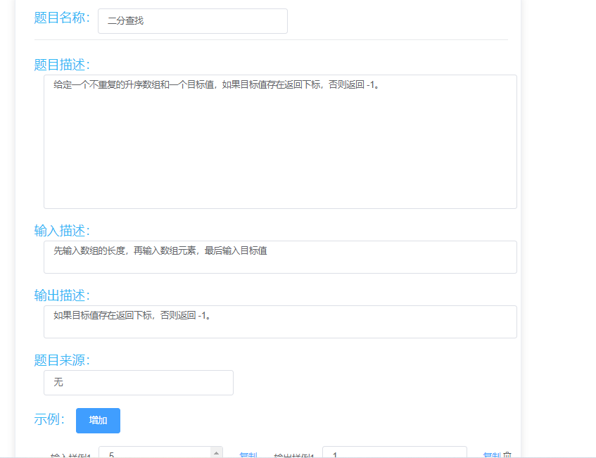
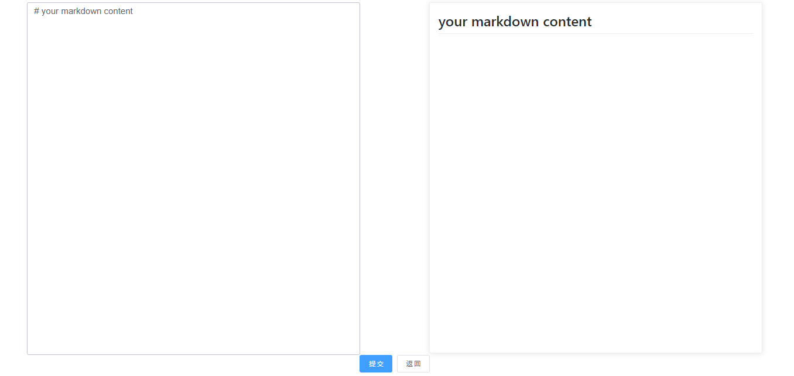

# Battle Judge

[中文](./README-CN.md)

> Online tow-player battle judge base on Vue and Django. The server issues the same problem to the user at the same time, and the one who completes it first wins.

## Feature

&#x2705;Two-player battle

&#x2705;Separated backend and frontend

&#x2705;Problem set and solution set

&#x2705;Markdown and Latex support

&#x2705;Multiple programming languages support

&#x274c;ACM/OI contest

## Note

&#x2757; For learning only, please do not deploy in the production environment.

## Modules

[Frontend(Vue)](https://github.com/BattleJudge/ojFE)

[Backend(Django)](https://github.com/BattleJudge/ojBE)

[Judge Server(QDUOJ)](https://github.com/QingdaoU/JudgeServer)

## Screenshot

## License

[MIT](http://opensource.org/licenses/MIT)