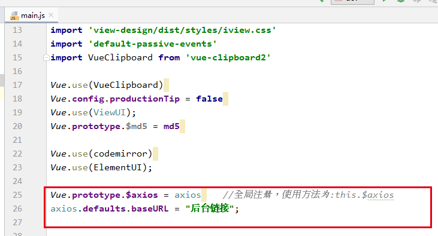
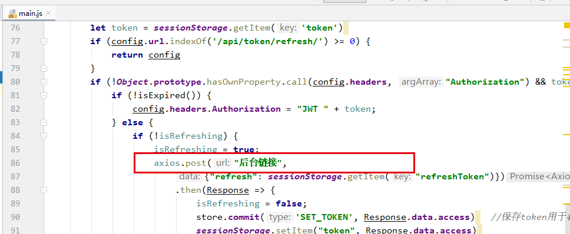
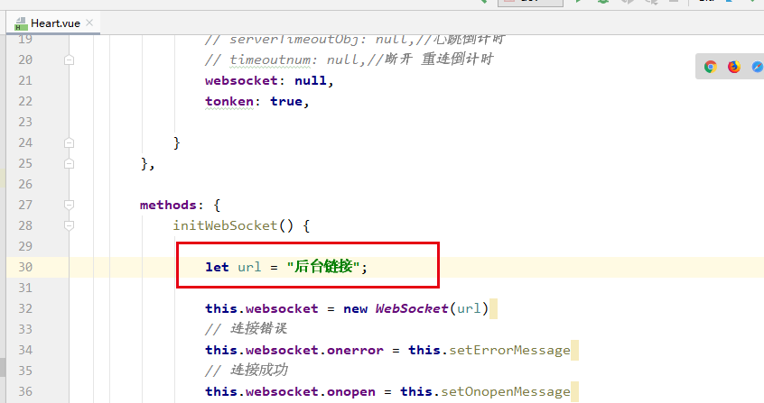

BattleJudge Fronted
===
</img>

Compiles and hot-reloads for development
---
~~~
npm run serve
~~~

Compiles and minifies for production
---
~~~
npm run build
~~~

The interface needs to be configured in the following files
---
main.js\

Utils/Heart.vue\

